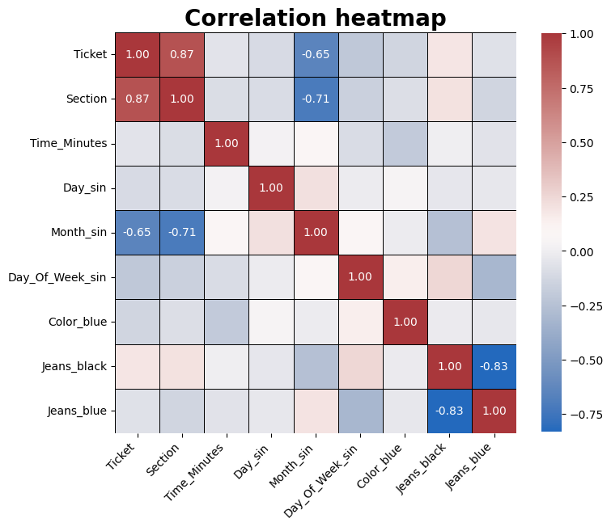
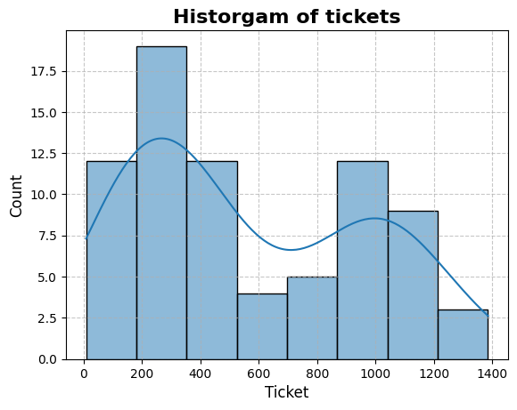

# Исследование номерков

## Описание
В течение всего "курточного сезона" 2024-25 года я собирал информацию о номерка, которые мне выдавали в гардеробе корпуса R на Покровском бульваре.

За период с 23 сентября 2024 по 15 марта 2025 набралась выборка из 76 номерков. Примерно столько раз я был на Покре за эти 19 недель.

У каждого объекта есть несколько признаков: 
- `Color` - цвет номерка;
- `Date` - дата выдачи;
- `Day_Of_Week` - день недели выдачи;
- `Time` - время, когда сделано фото номерка;
- `Jeans` - цвет джинс, в которых был взят номерок;
- `Section` - секция гардероба.

Было сложно придумать признаки.\
Номерки были либо синиего, либо чёрного цвета.\
Дата и день недели выдачи - кажется, это самый очевидный признак.\
Время, в которое было сделано фото, - я старался сразу же фотографировать номерок.\
Секция - гардероб разделён на 2 части: в первой - номерки от 1 до 828, во второй - от 829 до 1393.\
Цвет джинс - кажется, это самый странный признак, но почему бы и нет?) Когда смотрел фото, на некоторых были видны джинсы. Также где-то с середины осени я включил на телефоне живые фото (как на iPhone), и это сильно помогло узнать цвет. Но всё же некоторые номерки (6 штук) не имеют этого признака, потому что я не смог установить цвет джинс.

Всё делалось с учётом знаний, полученных на майноре "Интеллектуальный анализ данных", в частности ДЗ №4, и на курсе "Математическая статистика". На данный момент я знаю не очень много по поводу построения моделей, поэтому всё исследование может быть кривым.

## Исследование

Для начала надо обработать object-признаки.

Пустые значения заполним пустой строкой. Здесь пустыми были только признаки `Jeans` у 7 объектов.

Для `Time`, `Date`, `Day_Of_Week` применять обычное One-Hot кодирование кажется не совсем удачным решением, потому что они циклические (например, даты 1 январа и 31 декабря расположены близко, что не отображается в One-Hot). Поэтому для данных признаков я использую преобразование с использованием тригонометрических функций (cos и sin). 

Для признаков `Color` и `Jeans` используетя One-Hot.

Дальше посмотрим на корреляцию и гистограмму значений.

<figure>
    
    <figcaption>Корреляция признаков</figcaption>
</figure>

<figure>
    
    <figcaption>Гистограмма количества номерков по интервалам</figcaption>
</figure>

В качестве оценки ошибки используется MAPE.

Для предсказания номерка используется 4 модели: 
- `Linreg` - линейная регрессия;
- `Lasso` - линейная регрессия с регуляризацией Lasso;
- `Ridge` - линейная регрессия с регуляризацией Ridge;
- `kNN` - k-Nearest Neighbors.

В процессе обучения находим оптимальные значения для гиперпараметров $\alpha$ в `Lasso` ($\alpha = 7.4$) и `Ridge` ($\alpha = 0.1$), $k$ в `kNN` ($k = 7$).

Получаются следующие результаты MAPE для каждой модели:

| Model  | MAPE   |
---------|---------
| Ridge  | 328.80 |
| Lasso  | 318.21 |
| Linreg | 327.58 |
| KNN    | 94.84  |

Теперь проверим, что предскажут модели для следующих номерков и получим:

Model   | Date     | Ticket
--------|----------|--------
Ridge   | 17.03.25 | 334
Linreg  | 17.03.25 | 333
Lasso	| 17.03.25 | 340
kNN 	| 17.03.25 | 30

Model   | Date     | Ticket
--------|----------|--------
Ridge   | 18.03.25 | 407
Linreg  | 18.03.25 | 406
Lasso	| 18.03.25 | 385
kNN     | 18.03.25 | 232

Model   | Date     | Ticket
--------|----------|--------
Ridge   | 20.03.25 | 1056
Linreg  | 20.03.25 | 1059
Lasso   | 20.03.25 | 1030
kNN     | 20.03.25 | 30

А правильность этих предсказаний узнаем совсем скоро :)
